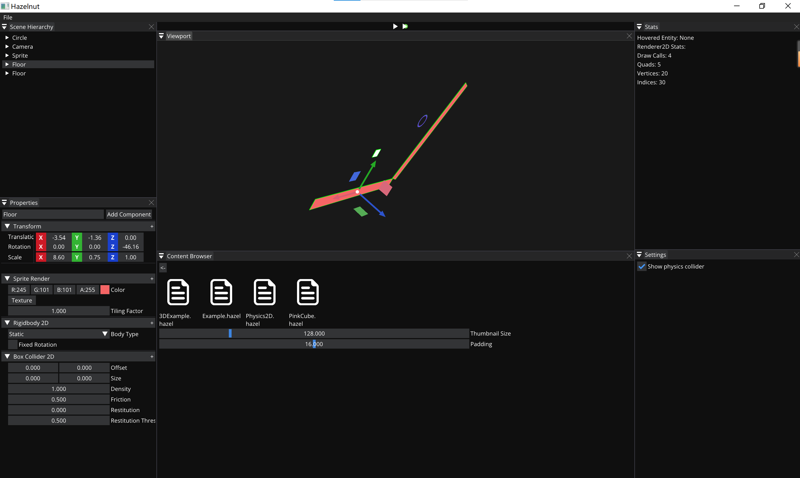

# Misaka Engine

Misaka Engine 是一个2D引擎，是以主流的游戏引擎为目标进行学习而开发的，目前主要有以下特点：

- 引擎整体分为运行时、编辑器、沙盒三个模块，编辑器与沙盒可复用同一套运行时代码，保证了便于进行游戏开发和验证；
- 引擎主要基于OpenGL进行传统光栅化渲染，同时对渲染相关的代码进行了抽象，可以便捷的切换不同的图形API；
- 引擎实现了ECS、物理碰撞、UUID、序列化与反序列化等核心功能，基本上完成了一个简单的游戏引擎的框架。
- 编辑器部分基于ImGui实现，支持运行模拟功能，viewport窗口支持键鼠视图变换和鼠标选择物体，材质文件支持拖拽选择；
- 沙盒部分是游戏最后运行的实际环境，使用与编辑器相同的运行时环境。

> 本引擎参考了 TheCherno/Hazel 的实现